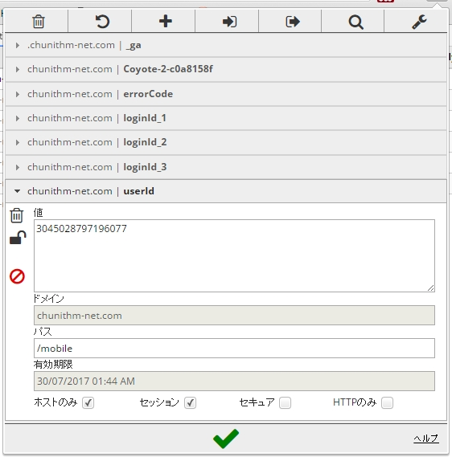

# CHUNITHM Rate Calculator
## 概要
CHUNITHM[©SEGA]のレート解析ツールです。

https://akashisn.info/chunithm/main.php にてAPIとして公開中
## 注意
**非公式です。**

**あくまで自己責任で使用してください。このツールを使用したことで起こったトラブルに制作者は責任を持ちません**
## 使い方
```js
javascript:(function(){
    if (!location.href.match(/^https:\/\/chunithm-net.com/)) {
        alert("CHUNITHM NETを開いた状態でしてください");
        throw Error();
    }
    window.name = 'CHUNITHM ■ CHUNITHM-NET';
    var html = '<form method="post" action="https://akashisn.info/chunithm/chunithm.php" id="postjump" target=_brunk style="display: none;"><input type="hidden" name="userid" value="' + document.cookie + '" ></form>';
    $("body").append(html);
    $('#postjump').submit();
    $('#postjump').remove();
})(document);
```
- このコードをブックマークレットに登録
- チュウニズムネットにログインした状態でブックマークレットを実行する

詳しくは https://akashisn.info/?article=4

### APIの仕様

https://akashisn.info/chunithm/main.php に

```
userid=3045028797196077
```
のような形でUserIDをPOSTすると
```json
{
    "Best": [
        {
            "MusicID": 104,
            "level": "master",
            "MusicName": "とーきょー全域★アキハバラ？",
            "Images": "img/ff945c9cb9e43e83.jpg",
            "BaseRate": 12.7,
            "Score": 1007664,
            "Rank": "sss",
            "BestRate": 14.7
        }
      ],
      "Recent": [
        {
            "MusicID": 104,
            "level": "master",
            "MusicName": "とーきょー全域★アキハバラ？",
            "Images": "img/ff945c9cb9e43e83.jpg",
            "BaseRate": 12.7,
            "Score": 1005985,
            "Rank": "ss",
            "BestRate": 14.39
        }
      ],
      "User": {
        "DispRate": 13.98,
        "MaxRate": 14.12,
        "RecentRate": 13.96,
        "RecentRate-1": 14.13,
        "BestRate": 13.93
    }
}
```
レート値が計算され、このようなJSON形式で帰ってきます。

***
***UserIDは***



https://chunithm-net.com/mobile/Home.html のクッキーにあります

## ファイル構成

```
CHUNITHM Rate Calculator
├ C++
| ├ chunithm-ex.json
| ├ chunithm-mas.json
| ├ chunithm.cpp
| ├ common.h
| └ model.json|
├ img
├ └ 1.jpg
├ PHP
| ├ lib
| | ├ Bookmarklet.js
| | ├ chunithm.css
| | ├ chunithm.js
| | ├ chunithm.json
| | ├ gif-load.gif
| | └ JsonConverter.php
| ├ chunithm.php
| ├ common.php
| ├ error.html
| ├ main.php
| └ usage.php
├ LICENSE.txt
└ REDME.md
```

## ライセンス
This software is released under the MIT License, see LICENSE.txt.
